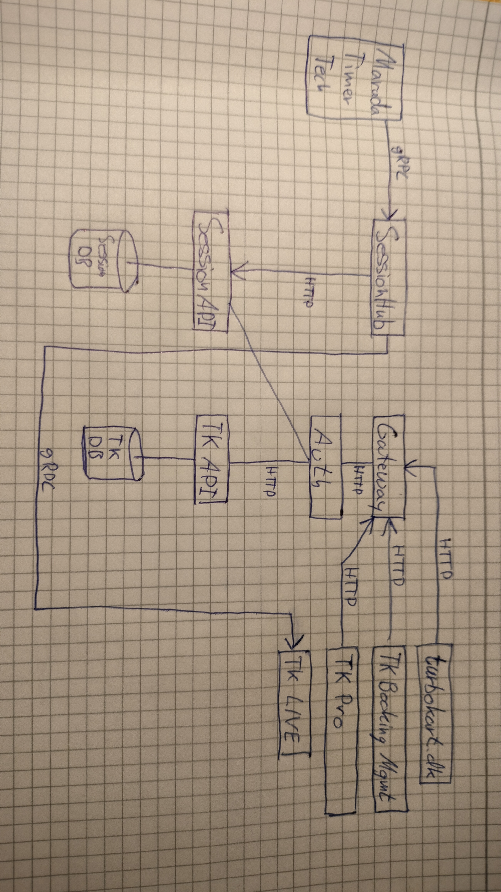

# TURBOKART
En case til implementering af distribuerede systemer.

Du skal forke [github.com/mads-mikkel/Turbokart](https://github.com/mads-mikkel/Turbokart) (master branch), og derefter clone til din maskine, og således arbejde videre på den løsning. Den indeholder kun Marada Lap Timer.

    

# 1. Systembeskrivelse
---
Turbokart er en virksomhed der tilbyder hæsblæsende gokart oplevelser!

Din opgave er at udvikle et system bestående af flere applikationer, der kommunikerer sammen. Her er et overblik over systemet:

    

# 2. Applikationer og datakilder
---
## 2.1. Datakilder
A. **TurbokartDB** er en database til Turbokarts forretningsdomæne.
B. **SessionDB** er en database til omgangstider.

## 2.2. Applikationer med brugergrænseflader
1. **turbokart.dk** er virksomhedens offentlige website.
2. **Turbokart Booking Management** er et internt website.
3. **Turbokart Pro** er et offentligt website til professionelle kartere.
4. **Turbokart Live** er et offentligt website til at vise omgangstider live.

## 2.3. Applikationer uden brugergrænseflader
5. **Gateway API** er et REST web API, der modtager offentlige HTTP forespørgsler, og router forespørgslerne til de relevante API'er.
6. **Auth API** er et REST web API, der håndterer autentificerer brugere til Turbokart Pro og ansattes login til Turbokart Booking Management.
7. **Turbokart API** er et REST web API, der håndterer tilgang til data i TurbokartDB.
8. **Session API** er et REST web API, der håndterer tilgang til data i SessionDB.
9. **SessionHub** er en SignalR server (SignalR Hub), der notificerer forbundne klienter om omgangstider.
10. **Marada Timer Tech** er et bibliotek til at simulere omgangstider.
    

# 3. Kravspecifikation
---
## 3.1 turbokart.dk
For at lave en hjemmeside til en virksomhed, skal man sætte sig ind i virksomhedens forretningsdomæne - det vil sige hvilke produkter de tilbyder, og hvordan de tilbyder det til deres kunder. Turbokart er en gokartbane, så derfor kan du lade dig inspirere af andre gokart hjemmesider.

**Funktionelle krav:**
1. Forsiden skal indeholde et logo, en overskrift "Turbokart", samt en kort beskrivelse af Turbokart.
2. Der skal være navigation til en bookingside, hvor brugeren kan booke en tid til at køre gokart for 1-20 personer. Flere bookings kan godt køre i samme session (warm-up, kvalifikation og grand prix), men der må ikke være flere end 20 karts i en session.
3. Der skal være navigation til en side med priser og beskrivelse af de to produkter man kan købe (lad dig inspirere af [vandelgokart.dk](https://vandelgokart.dk/)): 
    * enkelt grandprix
    * dobbelt grandprix
4. Nederst på hver side skal der være kontaktoplysninger og åbningstider.

**Ikke-funktionelle krav:**
1. Implementeres med ASP.NET Razor Pages.
2. Forsiden skal designes med farver, layout og fonte, der illustrerer "en hæsblæsende oplevelse".

## 3.2. Turbokart Booking management

## 3.2. Ikke funktionelle krav
Systemwide skal systemet implementeres i en CLEAN microservice arkitektur.

### 3.2.1. Datakilder

A. **TurbokartDB**: relationel MS SQL database.

B. **SessionDB**: relationel MS SQL database.

### 3.2.2. turbokart.dk

### 3.2.3. Turbokart Booking Management

    

# 4. Arkitektur
---
Vi skelner mellem den **logiske arkitektur** og **systemarkitekturen**. 

Den logiske arkitektur beskriver hvordan de forskellige applikationer og deres komponenter er sammenkoblet. Det er den måde vi organiserer koden på i Visual Studio, med forskellige typer projekter. Teknisk set, er det faktisk outputtet når vi compiler, der er den logiske arkitektur, dvs. hvordan de forskellige .exe og .dll filer er organiseret og sammenkoblet. Vi skal anvende CLEAN arkitekturen. Det sikrer, en modulær opbygning af kodebasen, således vi nemt kan genbruge f.eks. biblioteker og foretage forskellige typer tests.

Systemarkitekturen beskriver hvordan de forskellige applikationer kommunikerer med hinanden, når systemet kører. Her skal vi bruge microservicearkitekturen. Det sikrer, at vi har god oppetid, samt at man kan udvikle og deploye nye features og fejlrettelser uden at skulle lukke hele systemet ned.

Sammenfattende passer CLEAN godt sammen med microservices, netop fordi det er nemt at fejlsøge, teste, udvikle nye features og deploye til produktionsmiljøet.
    
