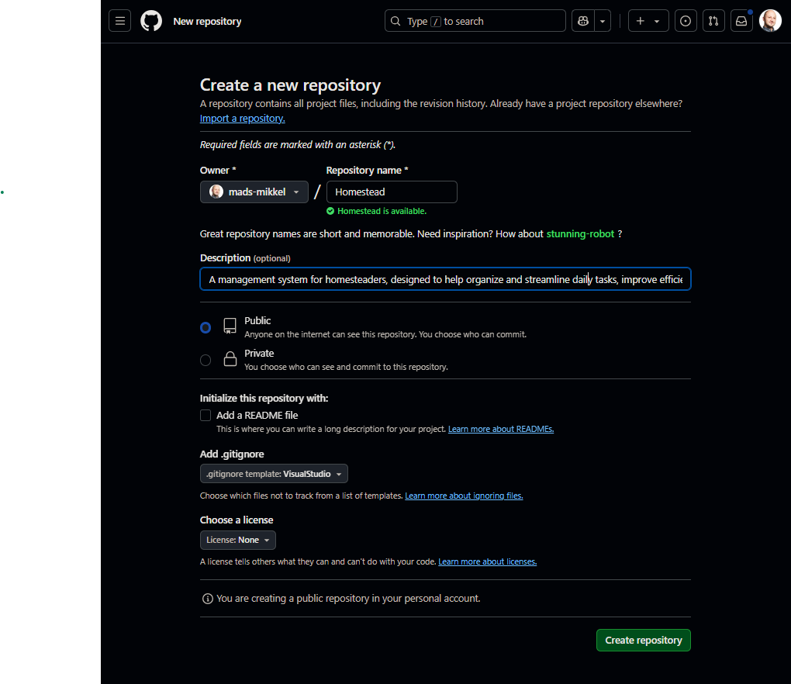

# Homestead Management System
This exercise will guide you through the process of creating a simple system. You must have basic experience with:
- HTML and CSS
- C# (variables, if-esle, loops, arrays/list and methods)
- Object Oriented C# (classes, objects, encapsulatioin, aggregation)
- git/GitHub for version control [OPTIONAL]

This exercise is structed as a guide. This means that each step will be explained with a purpose, learning objectives, and test at the end of each section.

We will use versioning, starting with version 0.1, incrementing to version 0.2 and so on, and ending with version 1.0 for the first production ready release. For each version we will detail the requirements.

## Introduction to the business domain

> **📘 Fact:** A business domain is the main area a business works in. It includes the important activities and knowledge needed for that field.

But first, you need some knowledge about the business domain: A homestead is a place where people live and grow their own food. It usually includes a house, garden, and animals like chickens or cows. Homesteaders try to be self-sufficient, meaning they produce most of what they need themselves.

## Why a homestead needs a management system
Managing a homestead involves many tasks, like keeping track of plants, animals, and tools. A Homestead Management System can help by:

- Organizing Information: Keeping all important details in one place.

- Improving Efficiency: Automating routine tasks and reminders.

- Helping with Decisions: Providing data to make better choices about crops and animals.

- Supporting Sustainability: Monitoring resource use to be more eco-friendly.

- Facilitating Communication: Helping family members or workers stay coordinated.

By using this system, homesteaders can work more efficiently and sustainably.

> **💡 Tip:** If you want to know more about homesteading, go online and search "homesteading" or chat with AI an assistant.

## Getting started
We are almost ready to start the development of version 0.1, but first we need some infrastructure. This includes setting up a local database (LocalDB), an Integrated Development Environment (IDE) like Visual Studio/VS Code, and version control with Git/GitHub. These tools will help us manage our code, track changes, and test our features effectively.

### Exercise: Create a Github repository and clone it to your computer
> **Purpose**: The purpose of this exercise is to familiarize you with the process of creating and managing a GitHub repository. By the end of this exercise, you will have a local repository connected to a remote GitHub repository, which will help you manage your code and track changes.

First, use your existing Github user account to create a Github repository. We will clone this in a moment. You can use the setup as depicted here:

> **❗ Important:** Remember to set the .gitignore template to **VisualStudio**. This ensures that only code files are pushed to GitHub, and unnecessary binary files are excluded.

The next step is to clone the repository to your computer. This can be done in several ways, either from an ide like VS Code or Visual Studio, or from the command line. Here are step by step guides to each of these ways:

#### Cloning from Visual Studio Code
1. Open Visual Studio Code.
2. Open the Command Palette (Ctrl+Shift+P).
3. Type Git: Clone and select it.
4. Enter the repository URL: https://github.com/username/homestead.git.
5. Choose a local folder where you want to clone the repository.
6. Wait for the cloning process to complete.

#### Cloning from Visual Studio
1. Open Visual Studio.
2. Go to File > Clone Repository.
3. Enter the repository URL: https://github.com/username/homestead.git.
4. Choose a local folder where you want to clone the repository.
5. Click Clone and wait for the process to complete.

#### Cloning from the Command Line
1. Open your terminal.
2. Navigate to the folder where you want to clone the repository using the cd command.
3. Run the following command:
`git clone https://github.com/username/homestead.git`
4. Wait for the cloning process to complete.

You should now have created a **local** git repository, this is connected to the **remote** Github repository. You can verify this by looking around the user interface in either VS Code or Visual Studio, or in the terminal by running `git remote -v`.

#### You know you have completed the exercise when...
1. You have created a GitHub repository and set the .gitignore template to VisualStudio.
2. You have successfully cloned the repository using one of the methods described.
3. You have verified that the local repository is connected to the remote GitHub repository.

### Exercise: Analayse the business domain to know what entities are involved