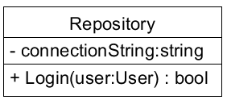

# Homestead Management System
These exercises will guide you through the process of creating a simple system. You must have basic experience with:
- HTML and CSS
- C# (variables, if-else, loops, arrays/list and methods)
- Object Oriented C# (classes, objects, encapsulatioin, aggregation)
- git/GitHub for version control [OPTIONAL]

This document is structed as a guide. This means that each step will be explained with a purpose, learning objectives, and learning checks at the end of each section.

We will use versioning, starting with version 0.1, incrementing to version 0.2 and so on, and ending with version 1.0 for the first production ready release. For each version we will detail the requirements. And after version 1.0 we will continue to develop new features, and modify the system towards best practice, as we go:

|Version|Key features|
|-------|------------|
| 0.1 | Log in (backend only)
| 0.2 | Basic livestock management
| 0.3 | Basic vegitable management
| 1.0 | Basic management |

These versions are meant to get you started, and are not meant to teach you all of the best practices - but they will come later.

<br><br><br>

## 1. &nbsp;&nbsp; Introduction to the business domain

> **📘 Fact:** A business domain is the main area a business works in. It includes the important activities and knowledge needed for that field.

But first, you need some knowledge about the business domain: A homestead is a place where people live and grow their own food. It usually includes a house, garden, and animals like chickens or cows. Homesteaders try to be self-sufficient, meaning they produce most of what they need themselves.

<br><br><br>

## 2. &nbsp;&nbsp; Why a homestead needs a management system
Managing a homestead involves many tasks, like keeping track of plants, animals, and tools. A Homestead Management System can help by:

- Organizing Information: Keeping all important details in one place.

- Improving Efficiency: Automating routine tasks and reminders.

- Helping with Decisions: Providing data to make better choices about crops and animals.

- Supporting Sustainability: Monitoring resource use to be more eco-friendly.

- Facilitating Communication: Helping family members or workers stay coordinated.

By using this system, homesteaders can work more efficiently and sustainably.

> **💡 Tip:** If you want to know more about homesteading, go online and search "homesteading" or chat with AI an assistant.

<br><br><br>

## 3. &nbsp;&nbsp; Getting started
We are almost ready to start the development of version 0.1, but first we need some infrastructure. This includes setting up a local database (LocalDB), an Integrated Development Environment (IDE) like Visual Studio/VS Code, and version control with Git/GitHub. These tools will help us manage our code, track changes, and test our features effectively.

### Exercise 01 [OPTIONAL]: Create a Github repository and clone it to your computer
> **Purpose**: The purpose of this exercise is to familiarize you with the process of creating and managing a GitHub repository. By the end of this exercise, you will have a local repository connected to a remote GitHub repository, which will help you manage your code and track changes.

#### Learning objectives
* How to create a Github repository.
* How to clone the repository to a local repository on your computer.
* How to verify that your local repository is connected to the Github repository.

First, use your existing Github user account to create a Github repository. We will clone this in a moment. You can use the setup as depicted here:


> **❗ Important:** Remember to set the .gitignore template to **VisualStudio**. This ensures that only code files are pushed to GitHub, and unnecessary binary files are excluded.

The next step is to clone the repository to your computer. This can be done in several ways, either from an ide like VS Code or Visual Studio, or from the command line. Here are step by step guides to each of these ways:

#### Cloning from Visual Studio Code
1. Open Visual Studio Code.
2. Open the Command Palette (Ctrl+Shift+P).
3. Type Git: Clone and select it.
4. Enter the repository URL: https://github.com/username/homestead.git.
5. Choose a local folder where you want to clone the repository.
6. Wait for the cloning process to complete.

#### Cloning from Visual Studio
1. Open Visual Studio.
2. Go to File > Clone Repository.
3. Enter the repository URL: https://github.com/username/homestead.git.
4. Choose a local folder where you want to clone the repository.
5. Click Clone and wait for the process to complete.

#### Cloning from the Command Line
1. Open your terminal.
2. Navigate to the folder where you want to clone the repository using the cd command.
3. Run the following command:
`git clone https://github.com/username/homestead.git`
4. Wait for the cloning process to complete.

You should now have created a **local** git repository, this is connected to the **remote** Github repository. You can verify this by looking around the user interface in either VS Code or Visual Studio, or in the terminal by running `git remote -v`.

#### Learning checks:
1. You have created a GitHub repository and set the .gitignore template to VisualStudio.
2. You have successfully cloned the repository using one of the methods described.
3. You have verified that the local repository is connected to the remote GitHub repository.

Toy are now ready to proceed to creating the database.

### Exercise 02: Creating the database
> **Purpose**: To create a reusable SQL script that can be run over and over again, as the database is modified.

#### Learning objectives
* Create a .sql file with a script to drop and create a database.
* Add SQL code to create a table for users, including columns for usernames and passwords, and insert data for at least two users.
* Run the script multiple times without errors, ensuring it successfully recreates the database and the Users table each time.

> **🎥 Video (no audio):** [Here is a video](https://intranet.aspit.dk/Fagets_Univers/Softwarekonstruktion/Documents/Materialer/MARA/Video/homestead-quick-walkthrough-01.mp4) detailing how to do it. It is recommended that you try it yourself, before watching it.

It turns out, that it is quite handy to have a script that deletes the entire database, if it exists, and then creates it all over again, with the modified changes:

```SQL
-- Use the Master database as the executing database
USE Master;
GO

-- Drop the database if it exists
DROP DATABASE IF EXISTS HomesteadDB;
GO

-- Create the database
CREATE DATABASE HomesteadDB;
GO

-- Use the database
USE HomesteadDB;
GO
```

First, create your own .sql file, and add SQL code for creating a table that holds users. This means data for their usernames and passwords.

Your script can be executed in either SSMS, VS Code, Visual Studio or even from the command line. Choose one approach, SSMS is recommended, but feel free to try them all.

#### Learning resources
Go to [W3Schools | SQL](https://www.w3schools.com/sql/) and learn how to create tables - you find the link to SQL Create Tables in the left side under 'SQL Database'.

#### Troubleshooting
* Can't figure out how to run a SQL script? Go online, and search "how to run a SQL script in SSMS". 
* Can't connect to `(localdb)\mssqllocaldb`? The **localdb** is part of the Visual Studio workload called Data Science and Processing. You install it via the Visual Studio Installer application.

#### Learning checks
1. You have created a .sql file with the provided script to drop and create the database.
2. You have added SQL code to create a table for users, including columns for usernames and passwords. Also, data for at least two users.
3. You can run the script multiple times without errors, and it successfully recreates the database and the Users table each time.

### Exercise 03: Choosing IDE
> **Purpose**: The purpose of this exercise is to help you choose and set up an Integrated Development Environment (IDE) for developing the .NET-based Homestead Management System. By the end of this exercise, you will have either Visual Studio or Visual Studio Code set up with a new project, ready for development.

#### Learning Objectives
* Understand the differences between Visual Studio and Visual Studio Code.
* Gain experience in adding an ASP.NET Core Web API project to your solution or project folder.

> **🎥 Video (no audio):** [Here is a video](https://intranet.aspit.dk/Fagets_Univers/Softwarekonstruktion/Documents/Materialer/MARA/Video/homestead-quick-walkthrough-02.mp4) detailing how to do it, but only to 1:15. It is recommended that you try it yourself, before watching it.

Depending on your preference for either VS Code or Visual Studio, you must make a choice of which IDE to use: 
* Visual Studio (recommended)
* Visual Studio Code

The main difference is that Visual Studio supports so-called **solutions** natively, and handles every step of the professional best practice software development, and most companies use this approach for .NET based code, because it is scalable, flexible and quite automated. 

So, now you have to choose, and then either:
* create a new **blank solution** in Visual Studio called, in your local git repository
* or, create a 'src' folder inside of VS Code, in your local git repository
You can freely decide the name of the solution/folder, for example *HomesteadMS*.

And then we must have a .NET web API project, so either:
* add a ASP.NET Core Web API project to the solution: Right click the solution, add project..., name it Api
* add a ASP.NET Core Web API project to the src folder, using the command line: `dotnet new webapi -n Api`

#### Learning checks
* You have chosen and set up either Visual Studio or Visual Studio Code as your IDE.
* You can see the new project in your IDE and are ready to start development.

<br><br><br>

## 4 &nbsp;&nbsp; Log In (v. 0.1)
In this section we will focus on creating the first simple feature: Log In.

The requirements are:

* The user must be able to successfully log in by providing the correct credentials.
* The user must be shown an error message, if wrong credentials are provided. 

We will first focus on the backend, and then create a simple webpage for the frontend afterwards. This section demonstrates the basic flow of data we will use going forward:
1. The user interacts with the frontend.
2. The frontend sends a request over the network to the backend API.
3. The API recieves the request, and handles it. Usually it is data to save to the database or fetching data from the database and sending it back to the user.

We need to do three things in the backend:
1. create a class that represents a user.
2. create a class that is responsible for handeling the interaction with the database.
3. create an API controller for handeling the requests from the frontend.

### Exercise 04: backend log in support
> **Purpose:** Creating support for the log in feature, in the backend of the system.

#### Learning objectives:
* Create the user class.
* Create the repository class.
* Create the log in API controller class.

> **🎥 Video (no audio):** [Here is a video](https://intranet.aspit.dk/Fagets_Univers/Softwarekonstruktion/Documents/Materialer/MARA/Video/homestead-quick-walkthrough-02.mp4) detailing how to do it, start from 1:15. It is recommended that you try it yourself, before watching it.

> **ℹ️** &nbsp; This section describes how to do it in Visual Studio, so if you use VS Code, you must find the equivalent ways of doing it yourself.

First, create the User class with id (int), username (string) and password (string) as auto-implemented properties. It should not contain anything else for now.

Now we need to create the Repository class. This class needs a NuGet package to function as the class responsible for the handeling the database. It is called `Microsoft.Data.SqlClient`. Install this NuGet package into the API project. If you need to learn how to do that, try searching "How to install nuget package in Visual Studio" or "How to install NuGet package in VS Code".

We need to declare a few members in the Repository class, so here is a UML diagram of it:



Now to the contents of the Login method:
```cs
public bool Login(User user)
{
    // Initialize the authentication status to false:
    bool isAuthenticated = false;

    // Create a new SQL connection using the connection string:
    SqlConnection connection = new SqlConnection(connectionString);
    
    // SQL query to check if the username and password match a record in the Users table:
    string query = $"SELECT COUNT(1) FROM Users WHERE Username = '{user.Username}' AND Password = '{user.Password}'";

    // Create a new SQL command with the query and connection:
    SqlCommand command = new SqlCommand(query, connection);  

    // Open the SQL connection:
    connection.Open();

    // Execute the query and get the count of matching records:
    int count = (int)command.ExecuteScalar();

    // Set the authentication status to true if a matching record is found:
    isAuthenticated = (count == 1);

    // Close the SQL connection:
    connection.Close();

    // Return the authentication status:
    return isAuthenticated;
}
```

The key take-aways are that we write the SQL query, executes it, and handles the result. This will be our approach for all so-called "transactions" with the database, going forward.

Next up, is creating the controller class that is responsible for handling request from the frontend. In this section we will use Visual Studio, and the built-in Swagger UI, to demonstrate how this works. Swagger is a UI in the browser, and we can use it to test to backend, without developing a frontend. 

First, right click on the Controller folder, in the API project, in the Solution Explorer. Then select Empty API Controller. Then name it LoginController.cs. This adds the new controller class to the API project.

Then add a method `public IActionResult Login(User user)`. Here is how it works:

> **📘 Fact:** An `IActionResult` allows us to return different types of responses, such as `Ok()` , `NotFound()`, `BadRequest()`, `Unauthorized()`, and more. We can even put strings as arguments for a response, such as `Ok("Success")` or  `Unauthorized("Wrong credentials provided")`.

When a method is in a Controller class, we call it an **action method** (it's just a name). When looking at the method, you may wonder how it actually works, that a `User` object can be provided as argument, by a connected client, such as a website. There is a lot going on under the hood, and the data is actually sent over the network as JSON, and is then parsed automatically whenever the action method is called.

An action method needs to be decorated with an attribute, representing what kind of HTTP method it is handling. In this case we need to decorate it with `HttpPost`. Here is the action method, with comments for the actual work that needs to be done:

```cs
[HttpPost]
public IActionResult Login(User user)
{
    // create an instance of the Repository class.
    // call the Login method with the user, and save the result of the authentication
    // return the appropriate IActionResult, based on the authentication result
}
```

And that is it. Run the project, and Swagger will appear in a broser window, allowing you to test the log in feature. If it does not work, then you need to debug and find the errors. You may also need to go online and search your problem, and/or chat with an AI assistant. Either way, you must make the feature work properly, before continuing.

<br><br><br>

## 5. &nbsp;&nbsp; Basic livestock management (v. 0.2)
Now things are getting exiting, because we are developing the very first feature of the business domain. The basic requirements are:
1. The user must be able to add livestock
2. The user must be able to edit livestock
3. The user must be able to delete livestock
4. The user must be able to view all livestock
5. The user must be able to add or edit the kind of livestock

Elaborating further we can argue that there are two entities here:
* **Livestock:** an animal with a date of birth, date of aquisition and an identification number, and a pet name.
* **LivestockKind:** the kind of livestock (chicken, cow, and so on).

We find the relation between these two entites by forming **meaningfull sentences**:
* One animal (livestock) is always one kind of livestock.
* Many animals can share the same kind of livestock.

So we have, what is called a "one-to-many" relationship between the two entities.

### Exercise 5.1: Add the tables to the database

### Exercise 5.2: Create the new classes

### Exercise 5.3: Modify the Repository class

### Exercise 5.4: Add a new controller class to the API

### Exercise 5.5: Create a simple frontend website for the Login

### Exercise 5.6: Modify the frontend for the livestock management feature


